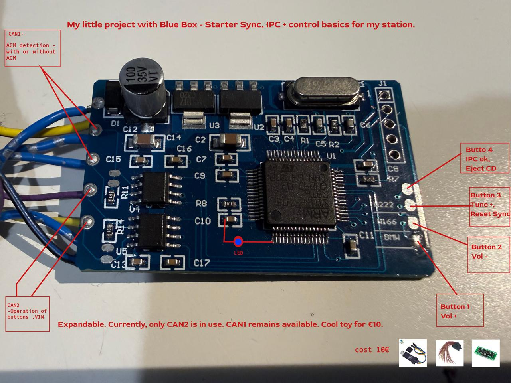

# STM32F105 Ford CAN Emulator

Experimental Ford SYNC/APIM and IPC bench-station starter built around a
dual-CAN STM32F105RBT6 board (commonly sold as a Blue Box).

The firmware generates the basic CAN traffic needed by a bench setup, detects
whether selected modules are present, transmits a configurable VIN, and maps
four physical buttons to multimedia and diagnostic CAN commands.

> [!WARNING]
> This project transmits CAN frames. Test it on an isolated bench setup first.
> Do not connect experimental firmware to a safety-critical vehicle network or
> use it while driving. Verify every arbitration ID and payload for your own
> modules and vehicle configuration.

## Hardware overview



The photograph documents the prototype wiring. In the current firmware:

- `CAN1` monitors module traffic, including ACM activity on frame `0x4D0`.
- `CAN2` handles APIM detection, emulator traffic, VIN transmission and button
  commands.
- The LED on `PA2` indicates emulator/APIM state.
- Four active-low buttons use the MCU's internal pull-ups.

## Features

- STM32F105RBT6 with two hardware bxCAN controllers.
- Both CAN channels configured for **500 kbit/s**.
- APIM presence detection using `0x048`, `0x3B2` and `0x3B3`.
- Automatic emulator mode when APIM traffic is absent for 500 ms.
- Periodic set of 37 Ford bench-emulation frames.
- ACM detection using CAN1 frame `0x4D0`.
- Fallback transmission of `0x1E6` and `0x2D5` after five seconds without
  `0x4D0`.
- Configurable 17-character VIN transmitted in frame sequence `0x40A`.
- Four physical buttons for volume, camera, SYNC reset and IPC/CD-eject
  functions.
- CAN recovery after bus-off or two seconds without accepted CAN activity.
- Short, bounded TX-mailbox retry handling to avoid blocking the main loop.

## CAN naming

The source uses physical controller names instead of ambiguous `FAST` and
`SLOW` names:

| Function | Role |
| --- | --- |
| `CAN1_PROCESS(&hcan1)` | Monitor CAN1 activity and detect `0x4D0`. |
| `CAN2_TICK(&hcan2)` | Schedule emulator and fallback frames on CAN2. |
| `CAN2_PROCESS(&hcan2)` | Receive APIM traffic and handle VIN/buttons on CAN2. |

## Connections

| Signal | STM32 pin | Purpose |
| --- | --- | --- |
| CAN1 RX | `PA11` | CAN1 receive |
| CAN1 TX | `PA12` | CAN1 transmit |
| CAN2 RX | `PB5` | CAN2 receive (remapped) |
| CAN2 TX | `PB6` | CAN2 transmit (remapped) |
| Status LED | `PA2` | Emulator/APIM state indication |
| Button 1 | `PA15` | VOL+ / camera on |
| Button 2 | `PC10` | VOL- / camera off |
| Button 3 | `PC11` | Tune+ / SYNC reset |
| Button 4 | `PC12` | IPC OK / Tune- / eject command |

The buttons are active-low: connect each input to ground through a momentary
switch. Use suitable CAN transceivers and correct bus termination. Do not add
termination without checking the existing bench wiring.

## CAN timing

Both controllers use:

```text
Prescaler: 2
BS1:       13 TQ
BS2:       2 TQ
SJW:       1 TQ
Bit rate:  500 kbit/s
```

The project expects the configured 25 MHz HSE clock and the clock tree stored in
`STM32CanBusMain.ioc`.

## Changing the VIN

Edit the 17-character value in [`Core/Src/canbus.c`](Core/Src/canbus.c):

```c
static const char VIN[] = "WF0JXXWPCJFM57486";
```

Keep exactly 17 VIN characters. The firmware divides this value between three
generated `0x40A` payloads. Use a test VIN or the VIN belonging to your own
bench modules; remove personal VIN data from public logs.

## Buttons

| Input | Short press | Hold |
| --- | --- | --- |
| `PA15` | `0x2A0` VOL+ | Camera-on sequence using `0x081`, `0x082`, `0x109` |
| `PC10` | `0x2A0` VOL- | Camera-off frame `0x109` |
| `PC11` | IPC/Tune+ sequence | SYNC ECU reset request `0x7D0` after 2 s |
| `PC12` | IPC/Tune- sequence | Eject/hold command after 600 ms |

Review the exact payloads in `DATA_TO_KEYS()` before adapting them to another
vehicle or module set.

## Build with STM32CubeIDE

1. Install STM32CubeIDE with STM32F1 support.
2. Clone or download this repository.
3. Choose **File → Import → Existing Projects into Workspace**.
4. Select the repository folder and import `STM32CanBusMain`.
5. Clean and build the project.
6. Flash it using ST-LINK or another compatible SWD programmer.

Generated `Debug/` and `Release/` directories are intentionally ignored.

## Source layout

- `Core/Src/canbus.c` — emulator frames, VIN, buttons and CAN recovery.
- `Core/Src/main.c` — clock, GPIO, CAN timing and hardware filters.
- `Core/Inc/canbus.h` — public CAN processing interface.
- `STM32CanBusMain.ioc` — STM32CubeMX project configuration.

## Contributing

Bench-test reports, verified payload descriptions, new module profiles and code
improvements are welcome. See [CONTRIBUTING.md](CONTRIBUTING.md).

## License

Project code is released under the [MIT License](LICENSE). STMicroelectronics
HAL and CMSIS sources under `Drivers/` retain their original license notices.
